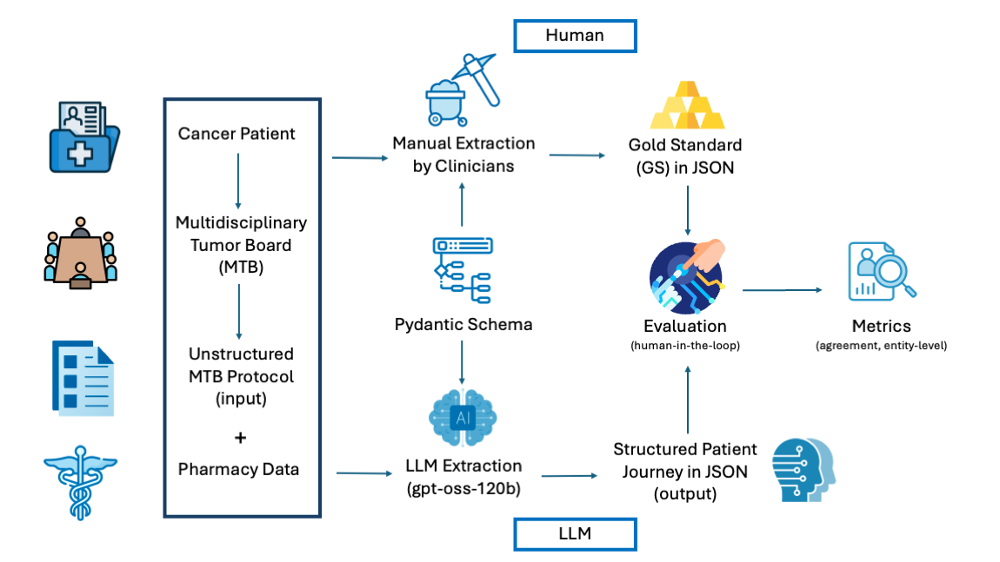

# MTB Extraction & Evaluation Pipeline

Automated longitudinal data ingestion for ovarian cancer care: the system ingests unstructured
multidisciplinary tumor board (MTB) protocols in Markdown, extracts structured, chronological
oncology patient journeys with a locally hosted large language model, and evaluates those
extractions against a clinician-adjudicated gold standard.

Reference implementation for *Toward Oncology Digital Twins: Leveraging LLMs for Automated
Longitudinal Data Ingestion in Ovarian Cancer Care* (see [Citation](#citation)).

The project has two halves:

- **Extraction** (`ehr.pipeline`) — a LangGraph state machine that maps dense clinical
  histories onto a strict Pydantic schema in a single extraction pass with a bounded
  validation-retry loop, persisting one JSON record per patient.
- **Evaluation** (`ehr.evaluation`) — an offline harness that scores predictions against a
  gold standard by **content-based field alignment**, reports per-field agreement and
  entity-level precision/recall, builds the human-review comparison table, and provides
  inter-rater and pharmacy-concordance analyses.

<p align="center">

  

</p>

## Repository layout

```
src/ehr/
├─ pipeline/                    # extraction (LangGraph)
│   main.py                     batch entry point (one thread per document)
│   graph.py                    workflow definition + routing
│   nodes.py                    load / extract / validate / persist nodes
│   state.py                    GraphState
│   schema.py                   Pydantic models (the output contract)
│   prompt.py                   system / user / retry prompt templates
└─ evaluation/                  # offline evaluation + reporting
    evaluate.py                 score predictions vs gold (scoring CLI)
    matching.py                 value normalization, field_type, field_equal, drug INN matching
    alignment.py                content-based pairing + joint flattening
    compare.py                  human-review comparison table (data layer)
    compare_xlsx.py             styled comparison workbook writer
    significance.py             GS vs Human agreement per field + exact McNemar significance
    interrater.py               inter-rater agreement (Clinician 1 vs Clinician 2) + Cohen's kappa
    agreement_stats.py          bootstrap CIs, Gwet's AC1, and trivial-agreement decomposition
    entity_metrics.py           entity-level precision/recall/F1 (missed and spurious entities)
    pharmacy.py                 extracted medications vs pharmacy dispensing records
    drugs.py                    active-ingredient canonicalisation
    normalization.py            deterministic date + biomarker-name normalisation
    _tableio.py                 shared table I/O for the reporting tools
docs/                           spec.md, output_structure.ts, workflow.png
```

## Requirements

- Python 3.12+
- [uv](https://github.com/astral-sh/uv) for environment and package management
- An OpenAI-compatible LLM endpoint (vLLM, a LiteLLM proxy, or Ollama) for the extraction half

## Setup

```bash
uv sync
```

Create a `.env` file in the project root:

```env
INPUT_DIR="./input"
OUTPUT_DIR="./output"
DB_PATH="checkpoints.sqlite"
MAX_RETRIES="3"
LLM_BASE_URL="http://localhost:8000/v1"
LLM_API_KEY="your-local-api-key"
LLM_MODEL="gpt-oss"
```

| Variable       | Default                    | Consumed by |
|----------------|----------------------------|-------------|
| `INPUT_DIR`    | `.`                        | `main.py`   |
| `OUTPUT_DIR`   | `./output`                 | `nodes.py`  |
| `DB_PATH`      | `checkpoints.sqlite`       | `main.py`   |
| `MAX_RETRIES`  | `3`                        | `nodes.py`  |
| `LLM_BASE_URL` | `http://localhost:8000/v1` | `nodes.py`  |
| `LLM_API_KEY`  | `no-key-required`          | `nodes.py`  |
| `LLM_MODEL`    | `gpt-oss`                  | `nodes.py`  |

## Extraction

Place one Markdown file per patient in `INPUT_DIR`. The filename must begin with the numeric
patient ID (e.g. `00123_tumorboard.md`); the leading digits become the patient ID and output
filename, and determine how records are merged across documents.

```bash
uv run ehr-extract           # equivalently: uv run python -m ehr.pipeline.main
```

Output is written to `OUTPUT_DIR` as `<patient_id>.json`, one file per patient. Re-processing
a document that shares a patient ID merges its `documents` into the existing record.

### Architecture

A cyclic state machine with five nodes (graph key → implementing function):

| Node           | Function                | Responsibility                                                        |
|----------------|-------------------------|-----------------------------------------------------------------------|
| `load`         | `load_document_node`    | Read the Markdown file at `document_id` into `raw_text`.              |
| `extract`      | `agent_extraction_node` | Build the prompt (injecting prior errors on retries) and call the LLM. |
| `validate`     | `validation_node`       | Re-validate via Pydantic and check domain logic (`startDate ≤ endDate`). |
| `persist`      | `persist_json_node`     | Write or merge the per-patient JSON record.                          |
| `failed_state` | inline node             | Terminal sink for documents that exhaust retries or hit a fatal error. |

Generation is constrained by the Pydantic `Patient` model
(`with_structured_output(Patient, method="json_schema")`) and re-validated against the same
model; Pydantic and domain-logic failures are appended to the next prompt and retried up to
`MAX_RETRIES` (default 3). A `SqliteSaver` checkpoints `GraphState` across node transitions,
so an interrupted run resumes by re-invoking the graph with the same `thread_id`.

## Evaluation

The evaluation tools are independent of the pipeline and run on folders of JSON files. Each is
available as a console script (shown below) and as `python -m ehr.evaluation.<tool>`.

### Score predictions vs the gold standard — `evaluate.py`

```bash
uv run ehr-evaluate --pred output --gold gold_standard --tag run1
```

Matches predictions to gold files by filename stem and scores every schema field. **List-valued
fields (treatment lines, medications, surgeries, biomarkers) are aligned by clinical content —
not by list position or a hash of their own fields** — so a reordered or differently-numbered
line is paired with its partner instead of splitting into a phantom missing + extra. Dates are
scored **day-exact**. Values are normalised before matching (lowercasing, punctuation/whitespace
folding, date canonicalisation, drug-name INN matching, and `unknown` / `not documented` / empty
treated as absent); biomarker names are folded to a controlled synonym vocabulary
(e.g. `HER2/neu` → `HER2`) before alignment, since biomarkers are matched by name. Outputs:

- `comparison_<tag>.csv` — every scored field with its gold value, predicted value, and label
  (`TP` / `FP` / `FN` / `MISMATCH`) for manual review;
- `metrics_<tag>.csv` — accuracy, precision, recall, F1, and support per field type.

Run with `--debug-treatments` to list any treatment line that found no partner (0 is ideal).

### Human-review comparison sheet — `compare.py`

```bash
uv run ehr-compare --gold gold_standard --output2 output_llm --out comparison.xlsx
```

Builds an `.xlsx` with one row per field — `patient_id | variable | ground_truth | output_2 |
evaluation` — where the output cell is highlighted red on disagreement (same match rule as
`evaluate.py`) and the **`evaluation`** column carries the per-field label: `match`, `mismatch`,
`missing` (gold has it, LLM empty), or `extra` (LLM has it, gold empty); empty-vs-empty counts as
`match`. This per-field categorisation is the deliverable — roll up whatever headline metric you
need from it (e.g. with `significance.py`) separately.

### Significance — GS vs Human — `significance.py`

```bash
uv run ehr-significance comparison.xlsx --gs-col GS --human-col Human
```

Per field (grouped Category / Field), the agreement of the pre-scored **`GS`** column
(primary) vs the **`Human`** column (baseline) — each row already a `match`/`mismatch`
verdict — the change `Δ` (GS − Human), and an exact **McNemar** test of the per-field
difference, FDR-corrected (Benjamini–Hochberg) to a `q`-value with significance stars.
Agreement is `match / total`. Prints a table to the terminal and writes an `.xlsx`.

In this study the two columns are the **same model output scored against two references**: `GS`
against the audited gold standard (independently corrected field-by-field against the source
protocols) and `Human` against the pre-audit human consolidation. The McNemar test therefore
measures the **effect of the audit** — its discordant pairs are driven entirely by the fields the
auditor changed (where the two references differ) — so a significant `Δ` (GS > Human) means the
model matched the source-verified value where the initial human consolidation had not.

### Inter-rater reliability — `interrater.py`

```bash
uv run ehr-interrater comparison.xlsx \
    --rater1-col "Ground Truth (Clinician 1)" --rater2-col "Ground Truth (Clinician 2)"
```

Per field type, percent agreement and **Cohen's κ** (chance-corrected) between the two clinicians
on the gold standard. κ can look low on near-constant fields despite high agreement — that is the
expected, correct behaviour. Prints a table and writes an `.xlsx`. A verdict-only column is also
supported with `--verdict-col` (percent agreement only, no κ).

### Supplementary agreement statistics — `agreement_stats.py`

```bash
uv run ehr-agreement-stats comparison.xlsx \
    --rater1-col "Ground Truth (Clinician 1)" --rater2-col "Ground Truth (Clinician 2)" \
    --model-col output_2 --gs-col Evaluation
```

Robustness statistics that complement `significance.py` and `interrater.py`, read from the same
comparison sheet:

- **Confidence intervals.** Each model-vs-gold agreement (per field and overall) is reported with a
  **95 % CI from a cluster bootstrap** that resamples the patients with replacement, so a patient's
  fields stay together and the interval respects within-patient dependence.
- **Gwet's AC1 alongside Cohen's κ.** Inter-rater agreement is given as both κ and the
  prevalence-robust **AC1**, because κ is deflated on high-prevalence fields (one category dominating,
  e.g. treatment status) where the model's agreement is better read against AC1.
- **Trivial-agreement decomposition.** The share of fields that are *Not documented* on **both** sides
  (jointly absent) and the overall agreement once those are removed (**documented-only** agreement),
  quantifying how much of the headline figure comes from mutual absence.

All point estimates are deterministic; only the bootstrap CI depends on `--seed` (default fixed) and
`--bootstrap-n` (default 20 000). Prints a table and writes an `.xlsx`.

### Entity-level precision and recall — `entity_metrics.py`

```bash
uv run ehr-entity-metrics comparison.xlsx \
    --gold-col "ground_truth (Clinician 2)" --pred-col output_2
```

Field-level agreement presupposes that an item was **aligned at all**: it scores the values
*inside* paired entities and is silent about entities the model missed entirely or introduced
spuriously. This tool closes that gap. Rows of the comparison sheet are grouped into their
entity instance (the field path minus its leaf, e.g. `doc0.treatment.med[0]`), and an entity
counts as present on a side when at least one of its fields carries a non-empty value under
`matching.norm`:

| | meaning |
|---|---|
| **TP** | entity present on both sides |
| **FP** | present only in the prediction (invented) |
| **FN** | present only in the gold standard (missed) |

Reported per list-valued entity type (treatment, medication, surgery, biomarker), grouped by
`matching.field_type` so the rows line up with the headline metrics. Scalar groups (patient,
document, diagnosis, tumor board) are not list-valued and have no presence question to answer,
so they are out of scope. Prints a table and writes an `.xlsx`.

### Pharmacy concordance — `pharmacy.py`

```bash
uv run ehr-pharmacy --pharmacy apotheke.xlsx --table comparison.xlsx --col "ground_truth (Clinician 2)" --tag run1
```

An objective check of the **gold-standard** therapies against pharmacy dispensing records at the
active-ingredient level. The gold medications are read from a comparison table's value column
(e.g. `ground_truth (Clinician 2)`), so this validates the gold rather than the LLM output. Per
patient and active ingredient, dispensing events are reduced to a span (first dispensing = start,
last = end) and compared against the gold dates at **month resolution** with a ±1-month (≤2-month
lenient) tolerance — the two sources record *documented* vs. *dispensed* dates, so exact-day
matching would measure logging granularity rather than agreement. Each pharmacy span is **capped at
the patient's protocol (document) date**: dispensings after that date could not have been recorded
in the gold standard, so a drug dispensed only afterwards is dropped and a span extending past it is
truncated. Reports presence (precision/recall/F1) and date concordance (start/end agreement within
tolerance); active-ingredient canonicalisation lives in `drugs.py`, which excludes supportive
medications and orally/externally dispensed agents (PARP inhibitors, oral endocrine therapy) that
the institutional intravenous pharmacy does not fill — dropped from **both** sides so the check
compares like with like.

## Output schema

The authoritative contract is the Pydantic model in `ehr/pipeline/schema.py`. For a readable
overview — including the allowed enum values per field — see `docs/output_structure.ts` (a human
reference only; not used at runtime). All fields are strings unless noted; optional fields are
marked.

```
Patient
  id
  dateOfBirth
  documents[]                       -> Document
    type
    date
    diagnoses[]                     -> Diagnosis
      tumor, date, figoStage (optional), tnmStage (optional), resectionStatus, relapse
      biomarkers[]                  -> Biomarker
        biomarker, value, type, date
    treatments[]                    -> Treatment
      type, startDate, endDate (optional), treatmentLine (int), status
      medications[]   (optional)    -> Medication
        medicationName, dosage, interval, startDate, endDate (optional)
      surgeries[]     (optional)    -> Surgery
        date, type, resectionStatus
    tumorBoardOutcomes[]            -> TumorBoardMeetingOutcome
      date, input, recommendation
```

Document-level `type` and `date` are reported under the `document.type` and `document.date` field
types in the metrics. Repeated list members are aligned by content (see Evaluation).

## Data and ethics

The extraction and evaluation operate on de-identified clinical documents inside a secured,
isolated environment; that data is **not** included in this repository. Only **synthetic**
fixtures (no real patient data) are shipped, under `tests/`. To reproduce on your own data,
place per-patient Markdown files in
`INPUT_DIR` and gold-standard JSON files in a `gold/` folder, then follow the steps above.

**Data availability.** The data that support the findings of this study are available on
request from the corresponding author. The data are not publicly available due to privacy or
ethical restrictions.

**Ethics.** Local ethics approval was granted (No. 2025-362-S-CB).

## Citation

If you use this code, please cite:

> Houri, L., Tahiri, N., Voelker, G., Arlanch, E., Koechert, M., Frank, J., Kuligin, L.,
> Lübberstedt, J., Bressem, K., Boeker, M., Tschochohei, M., Lammert, J.:
> Toward Oncology Digital Twins: Leveraging LLMs for Automated Longitudinal Data
> Ingestion in Ovarian Cancer Care. MICCAI 2026 Workshop (2026).

**Contact.** Leen Houri — leen.houri@tum.de
Chair of Medical Informatics, Institute for AI and Informatics in Medicine,
TUM School of Medicine and Health, Technical University of Munich, Munich, Germany.

## Further documentation

- `docs/spec.md` — detailed specification of the pipeline, orchestration, and evaluation.
- `docs/output_structure.ts` — the target output structure with allowed enum values.

## License

MIT — see [LICENSE](LICENSE).
